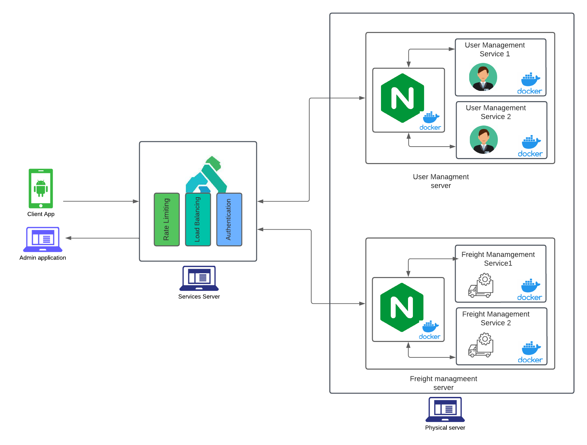

# Description

A small implementation of the fourth year software architectures class project in the context of designing a distributed microscoservice architecture to enhance the supply chain system of Algeria through benifitting from empty return trips.

For this implementation we have :
1. Admin webapp
2. User mobile app
3. Application server
4. Freight management server
5. Kong api gateway

# Architecture
The overall architecture of the project is illustrated bellow :

